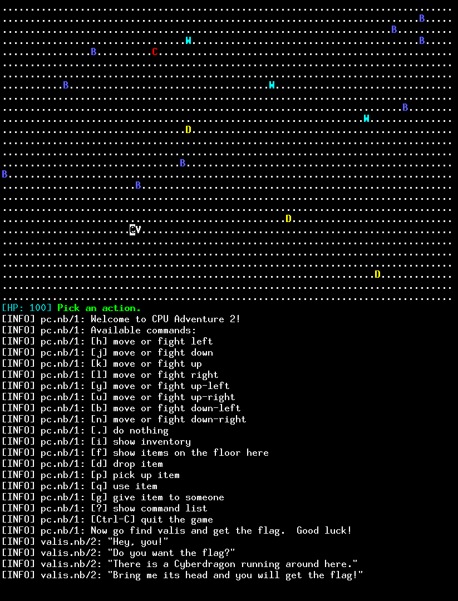

This is the CPU Adventure 2 task from the Dragon CTF 2019.

The task is about reverse engineering and pwning code for a custom CPU
architecture, based on a balanced ternary system.

If you want to solve it the intended way, you can look at the following files:

- ``emu``
- ``*.nb``

You're supposed to pwn the game running on a remote server.  To set up your
own server, do the following:

    socat tcp4-listen:1337,fork,reuseaddr exec:./emu,pty,setsid,setpgid,ctty,stderr,rawer

To connect to it and play the game:

    socat tcp4-connect:127.0.0.1:1337 fd:0,rawer

The author's solution is in the ``solution`` directory.

There are three stages in this challenge, with the flags in ``flag1.txt``, ``flag2.txt``,
and ``flag3.txt``.  The original task decriptions from the CTF are:

CPU Adventure 2.1: introspection
--------------------------------

It turns out that my grandfather has built more than one strange computer.

This is the first level of the task.  The flag is in flag1.txt.

CPU Adventure 2.2: expansion
----------------------------

Are you tired of binary exploitation?  Try non-binary exploitation!

This is the second level of the task.  The flag is in flag2.txt.

CPU Adventure 2.3: escalation
-----------------------------

Strange game.  The only winning move is to pwn the engine.

This is the final level of the task.  The flag is in flag3.txt.
